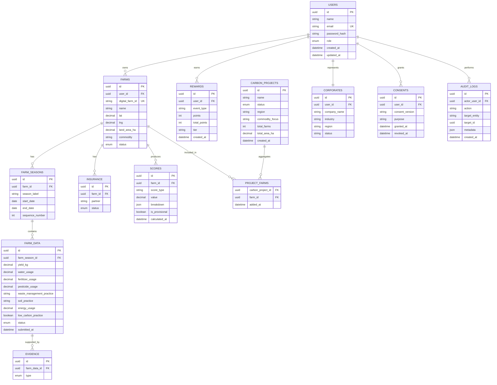

# Entity Relationship Diagram

## Logical ERD

## Relationship rules

- A farmer owns one or more farms.
- A farm has multiple seasons.
- A season has farm data submissions.
- Farm data may have multiple evidence records.
- A farm may have insurance records.
- A farm produces score records.
- A user earns reward records.
- Projects aggregate farms through `project_farms`.
- Corporate identity is attached one-to-one to a user.
- Consent belongs to a user.
- Audit logs identify the user who performed the action.

## Privacy boundary

Corporate project APIs must aggregate:
- farm count
- area
- commodity
- region
- project status
- other explicitly approved aggregate indicators

They must not return individual farmer identities in the MVP.
